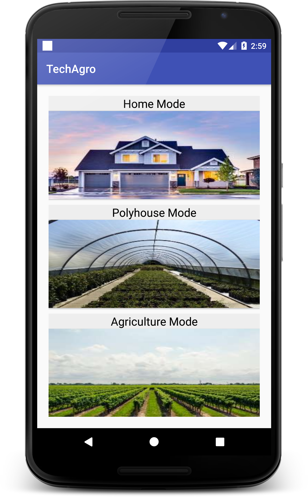
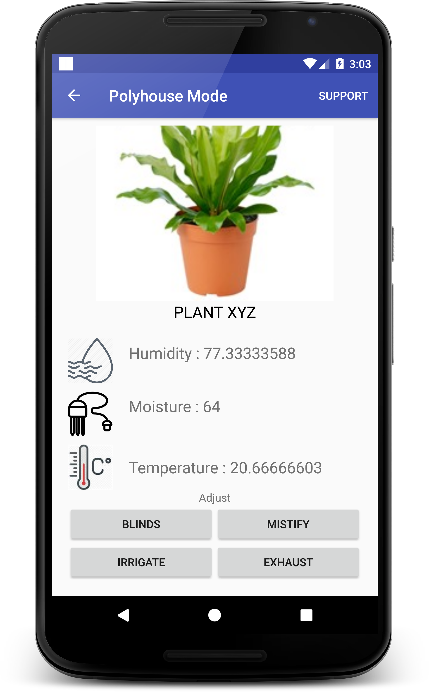
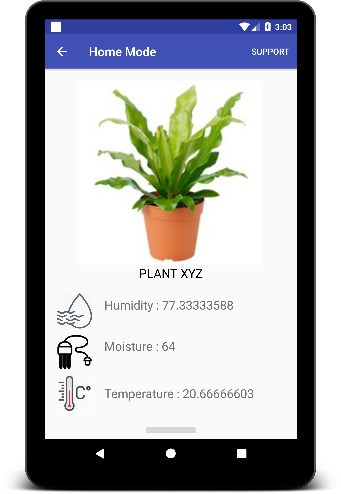

# Precision-Farming-IOT-2018

<a href="http://yashtiwari.tech/legacy/project_asset/precision_farming.pdf">View Our Presentation</a>

## Introduction:
Precision farming is defined as the site-specific management of farmland that utilizes the use of modern technologies 
to augment crop yields. With the aid of sensors and satellite imageries, farmers can judiciously use their resources. 
In such a manner that the entire process of crop production becomes both profitable and sustainable.

This smart agricultural management is underpinned on AI and IOT. For example, soil sensors collect static and dynamic 
data to analyse and examine the nutritional and water requirement of the crops. With the IOT mobile app in hand, farmers can know the water used and saved in their farming practices. Moreover, the smart irrigation solution feeds the crops without requiring the farmer to be physically present on the field. Likewise, ML analysis and algorithms have enabled the accurate detection and controlling of pests by analysing the crop water need.

All these technologies in together combined form the heart of precision agriculture. These determinants fuel the crop production cycle, which in turn, maximizes the ROI of farmers. 	

# Project
Project Work submitted to Smart India Hackathon Organized by BNest 2018:
We had participated in a Hackathon and we managed to come in top 20 teams all across India.
Agriculture provides engagement to more than 50% population in India but still agriculture is the most neglected domain, talking on the basis to Technology Penetration as compared to other domains.Our topic was Internet of Things in Precision Farming. We were able to build a network of Sensors and Actuators and procure data from soil and plants. We were able to record three types of values:

1. Humidity
2. Moisture Content
3. Temperature

We used an interface to plot the values of the data procured, the link is here: http://yrtwebhosting-com.stackstaging.com/arduino/analysis.php . 

Our purpose is to study various conditions of plants soiland to learn deeper understanding of  Agro Tech, Sustainable food production, Various Measures of Precision Farming, Developing Algorithms for automation in AgroTech etc.

  
  
  

